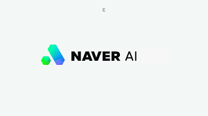
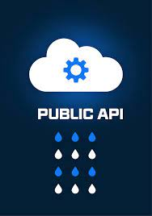

# 인공지능 API 소개
## [목차]
[1. 개요](#1-개-요)

[2. 대표적인 인공지능 API](#2-대표적인-인공지능-api)

- [2.1 구글](#21-구글)

- [2.2 네이버](#22-네이버)

- [2.3 맡김](#23-맡김)

[3. 프로젝트1에서 활용해 볼 API 선정 및 설명](#3-프로젝트1에서-활용해-볼-api-선정-및-설명)


## 1. 개 요
인공지능 API란  인공지능 기술을 사용하여 다양한 응용 프로그램을 개발할 수 있도록 하는 인터페이스이다.

인공지능 API는 현재 다양한 기업 및 플랫폼에서 제공하고 있으며, 개발자들이 복잡한 인공지능 모델과 알고리즘을 구현하거나 자신의 애플리케이션에 통합할 때 필요한 도구와 리소스를 제공한다.

- 인공지능 API가 제공하는 기능
  - 데이터 처리 : 데이터를 수집하고 전처리하여 인공지능 모델이 학습할 수 있는 형태로 변환

  - 모델 학습 : 인공지능 모델을 학습시켜 사용자의 요구에 맞는 예측 및 분석 결과를 제공

  - 모델 추론 : 학습된 모델을 사용하여 새로운 데이터에 대한 예측 및 분석 결과를 제공

  - 모델 배포 : 학습된 모델을 배포하여 사용자가 언제 어디서나 사용 가능
<br/>
<br/>
- 인공지능 API의 종류

  - 이미지 인식 : 이미지를 인식하여 객체를 분류하거나 특징을 추출

  - 자연어 처리 : 텍스트를 분석하여 의미를 추출하거나 문장의 의미를 파악

  - 음성 인식 : 음성을 인식하여 텍스트로 변환

  - 영상 분석 : 영상을 분석하여 객체를 탐지하거나 움직임을 추적

  - 강화 학습 : 게임이나 문제 해결을 통해 모델을 학습시켜 최적의 행동을 선택

인공지능 API는 다양한 기업에서 제공하고 있으며, 사용자는 자신의 요구에 맞는 API를 선택하여 사용할 수 있다.
<br/>
<br/>

- 인공지능 API의 장점

  - 빠른 개발 속도 : 인공지능 모델을 직접 개발하지 않아도 API를 사용하여 빠르게 개발 가능

  - 높은 정확도 : 인공지능 모델을 학습시켜 높은 정확도를 보장

  - 다양한 기능 제공 : 다양한 기능을 제공하여 사용자의 요구에 맞는 응용 프로그램을 개발 가능

  - 쉬운 사용 방법 : 사용자가 쉽게 사용할 수 있도록 API를 제공
  <br/>
<br/>

- 인공지능 API의 단점

  - 높은 비용 : 인공지능 모델을 학습시키는 데 많은 시간과 비용이 소요

  - 기술적 한계 : 인공지능 모델의 기술적 한계로 인해 정확도가 떨어지는 경우 존재

  - 보안 문제 : 개인정보나 민감한 정보가 노출될 수 있으므로 보안 문제에 대한 고려가 필요
  <br/>
<br/>

- 인공지능 API를 사용할 때의 주의사항

  - 데이터 보안 : 개인정보나 민감한 정보가 노출될 수 있으므로 데이터 보안에 대한 고려가 필요

  - 모델 성능 : 모델의 성능을 최대한 높이기 위해 데이터를 수집하고 전처리하는 과정이 중요

  - 사용자 요구에 맞는 API 선택 : 사용자의 요구에 맞는 API를 선택하여 사용해야 함 

  - 모델 업데이트 : 모델의 성능을 높이기 위해 주기적으로 업데이트 필요

  - 보안 강화 : 보안 문제를 예방하기 위해 보안 강화에 대한 노력이 필요


<details>
<summary>마크다운 부가 기능</summary>

* ㅁ
  * ㅁㅁ
    * ㅁㅁㅁ

- ㅁ
  - ㅁㅁ
    - ㅁㅁㅁ

+ ㅁ
  + ㅁㅁ
    + ㅁㅁㅁ

> 인용문

* 스타일 적용하기
* **진하게** (`Ctrl + B`)
* *기울이기* _기울이기_ (`Ctrl + I`)
* <s>취소선</s>
* <u>밑줄</u>

### 소스코드 넣기
```cpp
#include<studio.h>
int main() {
  float a = 1.0;
  float b = 2.0;
  c = a + b;
  print("%d\n", c);
}
```
```python
sum = 0
for j in range(10):
  sum += j
print("sum form 1 to 10 : ", sum)
```
```python
import pandas as pd
file_path = "Enter your file path"
df = pd.read_csv(file_path)
df.head()
```

</details>


## 2. 대표적인 인공지능 API


### 2.1 구글
- [Vision API](https://cloud.google.com/vision?hl=ko)
<p align="center">

</p>

  - Vision API는 이미지를 인식하여 분류, 분석을 하는데 특화 되어있는 인공지능 API이다.

<details>
<summary>관련 상세 내용</summary>

1. 객체 탐지: Vision API는 이미지 내의 다양한 객체(사람, 동물, 건물 등)를 식별하고 위치를 찾을 수 있다.

2. 얼굴 인식: 얼굴의 위치와 특징, 때로는 감정 상태(행복, 슬픔 등)까지 파악할 수 있다.

3. 텍스트 추출 (OCR): OCR(Optical Character Recognition) 기능을 통해 이미지에서 텍스트를 읽어낼 수 있다.

4. 라벨링 및 분류: Vision API는 이미지에 대한 설명이나 태그(label) 제공이 가능하다.

5. 유사 이미지 검색: 유사한 콘텐츠나 패턴을 가진 다른 이미지들을 찾아내는 것도 가능하다.
</details>
<br/>
<br/>

- [Natural Language API](https://cloud.google.com/natural-language?hl=ko)
<p align="center">

</p>

- Natural Language API 텍스트 데이터의 자연어 처리와 분석을 간편하게 수행할 수 있는 도구이다.

<details>
<summary>관련 상세 내용</summary>

1. 감정 분석: 텍스트 데이터의 감정을 분석하여 긍정적, 부정적 또는 중립적인 감정을 판단합니다. 이를 통해 사용자의 감정 및 의견을 이해할 수 있다.

2. 엔터티 인식: 텍스트에서 중요한 엔터티(명사 또는 주요 단어)를 추출하고, 그 엔터티의 유형(예: 사람, 장소, 기관)을 식별합니다. 문서의 주요 내용을 추출하는 데 도움을 준다.

3. 텍스트 분류: 주어진 텍스트를 자동으로 카테고리화하고, 어떤 주제 또는 카테고리에 속하는지 분류합니다. 뉴스 기사, 소셜 미디어 게시물 등을 분류할 때 유용하다.

4. 개체 관계 분석: 문장 내에서 엔터티 간의 관계를 분석하여 어떤 엔터티가 다른 엔터티와 어떻게 관련되어 있는지 이해합니다. 지식 그래프 구축 및 정보 추출에 활용된다.

5. 문장 분석: 문장 구조를 분석하여 주어, 동사, 명사구 등과 같은 구성 요소를 식별하고 문장의 구조를 파악합니다. 문법 및 문장 분석 작업을 자동화한다.
</details>
<br/>
<br/>

- [Translation API](https://cloud.google.com/translate/?hl=ko)
<p align="center">

</p>

- Translation API는 텍스트 번역에 사용되는 구글의 서비스로, 다국어 텍스트 번역 작업을 간단하게 처리할 수 있도록 도와준다.

<details>
<summary>관련 상세 내용</summary>

1. 텍스트 번역: 주어진 텍스트를 한 언어에서 다른 언어로 번역할 수 있습니다. 예를 들어, 영어 문장을 스페인어로 번역하는 작업의 수행이 가능하다.

2. 다국어 지원: Translation API는 다양한 언어를 지원하며, 수백 가지 언어 간의 번역을 제공합니다. 이를 통해 글로벌 커뮤니케이션을 쉽게 처리가 가능하다.

3. 텍스트 감지: API는 주어진 텍스트의 언어를 자동으로 감지할 수 있다. 따라서 입력 텍스트가 어떤 언어인지 지정하지 않아도 텍스트를 감지한다.

4. 대용량 번역: 대규모 텍스트 데이터셋을 효율적으로 번역할 수 있으며, 대용량 데이터 처리에 적합하다. 이를 통해 다국어 문서를 번역하거나 다국어 사용자 인터페이스를 지원할 수 있다.

5. 번역 메모리 관리: Translation API는 이전 번역 결과를 저장하고 재사용하여 비용을 절감하고 일관된 번역을 제공하는 데 도움을 준다. 이를 통해 효율적인 번역 작업을 수행할 수 있다.
</details>
<br/>
<br/>

- [Speech-to-Text API](https://cloud.google.com/speech-to-text?hl=ko)
<p align="center">

</p>

- Speech-to-Text API는 음성 데이터를 텍스트로 변환하는 데 사용되는 구글의 서비스로, 음성 인식 및 처리 작업을 간편하게 수행할 수 있도록 도와준다. 
<details>
<summary>관련 상세 내용</summary>

1. 음성 인식: API는 다양한 음성 입력을 텍스트로 변환한다. 이를 통해 음성 녹음, 오디오 파일, 스트리밍 음성 데이터 등을 텍스트로 변환하여 음성 데이터를 분석하고 활용할 수 있다.

2. 다국어 및 다양한 억양 지원: API는 다양한 언어와 억양을 지원하며, 글로벌 시장에서 음성 데이터를 효과적으로 처리할 수 있다.

3. 노이즈 및 음성 품질 관리: API는 노이즈와 음성 품질에 대한 처리를 제공하여 음성 입력의 정확성을 향상시킨다. 이를 통해 주변 환경에서 나오는 잡음을 제거하고 명확한 텍스트를 생성한다.

4. 스트리밍 지원: API는 실시간 음성 스트리밍 데이터를 처리할 수 있다. 이를 통해 음성 인식 기능을 실시간 음성 통신 또는 음성 명령과 같은 응용 프로그램에 통합할 수 있다.

5. 특수 용도 모델: 특정 분야(의료, 법률, 기술 등)에 특화된 음성 모델을 사용하여 해당 분야의 전문 용어 및 억양을 더 잘 이해하고 처리할 수 있다.
</details>
<hr/>

### 2.2 네이버
- [Naver AI Services](https://www.ncloud.com/product/aiService/)

<p align="center">

</p>

  - 네이버가 개발한 AI를 이용해 다양한 AI 서비스와 API를 제공해 준다.

<details>
<summary>관련 상세 내용</summary>

1. CLOVA OCR Update : 인쇄물 속 글자를 추출하여 디지털 데이터로 변환해 주는 서비스

2. CLOVA VoiceUpdate : 다양하고 자연스러운 목소리를 만들 수 있는 고품질 음성 합성 서비스

3. CLOVA ChatbotUpdate : 마케팅, 고객 응대 등 다양한 서비스에 활용할 수 있는 챗봇을 생성하는 서비스

4. AiTEMS : 사용자별 이력을 분석하여 관심사와 취향에 맞는 상품을 추천하는 서비스

5. CLOVA CareCallNew : AI가 일상적인 주제로 대상자와 통화하면서 건강 상태를 확인하는 전화 돌봄 서비스
</details>
<hr/>

### 2.3 맡김
- [맡김](https://www.matgim.ai/public-api/)
<p align="center">

</p>

  - 공개 API와 소비자가 원하는 커스텀 API를 이용할 수 있도록 서비스를 제공해준다.

<details>
<summary>관련 상세 내용</summary>

1. 사람들이 많이 찾고 요청하는 API에 대해서는 공개 API를 제작하여 공개하였다.

2. 공개 API의 경우 자연어 처리에 관련한 내용들이다.

3. 키워드 추출 : 문서를 입력받아 문장으로 분리, 각 문장에서 명사를 추출해 빈도와 함께 반환해준다.

4. 감성분석 :문서에 대한 긍정/부정, 문서에 나타난 개체에 대한 긍정/부정도 추출하여 반환해준다.

5. 원하는 API가 있을경우 커스텀 API 서비스를 통해 제공해준다.
</details>
<hr/>

## 3. 프로젝트1에서 활용해 볼 API 선정 및 설명

- 네이버에 있는 취향 추천 서비스 AiTEMS와 챗봇 서비스 CLOVA Chatbot를 활용하여 내 취향이 분석 된 이후 간단한 대화를 통해서 확실한 나의 취향을 찾는 서비스를 구축해보고 싶다.

- 번역 서비스와 감정분석 서비스를 통해서 주식이나 세계의 이슈들에 대한 분석을 할 수 있는 서비스를 구축하고 싶다.

- API에 대해서는 찾지 못했지만 기존의 판매량 데이터들의 분석을 통해서 미래의 수요, 매출 등의 예측을 할 수 있는 판매자를 위한 서비스를 구축하고 싶다.